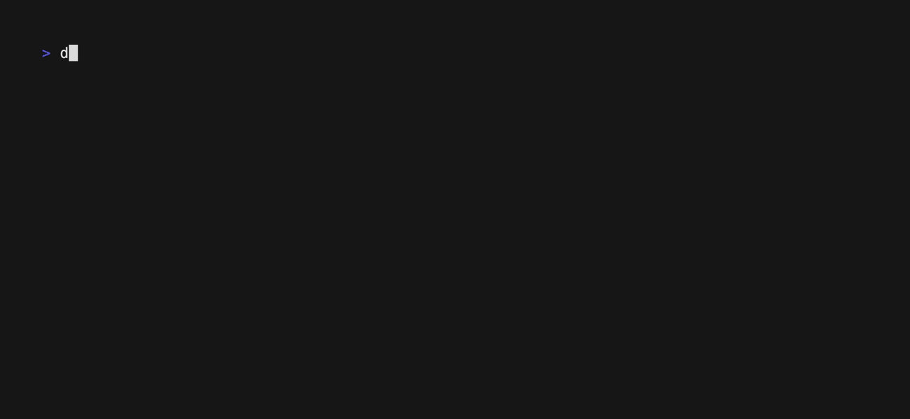

# Scarab 🪲


A microbenchmarking framework for Riot inspired by Elixir's [benchee][benchee]
and Rust's [criterion-rs][criterion].

[benchee]: https://github.com/bencheeorg/benchee
[criterion]: https://github.com/bheisler/criterion.rs



## Getting Started

```
opam pin riot git+https://github.com/leostera/riot
opam pin scarab git+https://github.com/leostera/scarab
```

And you can now create executables that use `scarab` as a library:

```
(executable
  (name my_bench)
  (libraries scarab))
```

Here's an example benchmark:

<!-- $MDX file=./test/run_test.ml,part=run -->
```ocaml
Scarab.run ~name:"sums"
  [
    ("sum 1", fun () -> sum 1);
    ("sum 100", fun () -> sum 100);
    ("sum 1_000", fun () -> sum 1_000);
    ("sum 2_000", fun () -> sum 2_000);
    ("sum 5_000", fun () -> sum 5_000);
    ("sum 10_000", fun () -> sum 10_000);
    ("sum 100_000", fun () -> sum 100_000);
  ]
```
